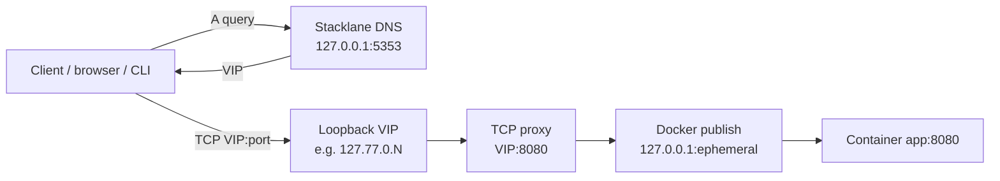

# Stacklane

Stacklane gives parallel Docker Compose stacks (and Git worktrees) **stable hierarchical local hostnames** and **conflict-free standard ports** by combining:

1. **Per-stack loopback VIPs** from a private pool (default `127.77.0.0/16`)
2. **Authoritative DNS** for `*.stacklane.test` (default listen `127.0.0.1:5353`)
3. **Local TCP proxy** from `VIP:publicPort` → Docker’s ephemeral `127.0.0.1:hostPort`

You publish containers only on loopback with Compose’s ephemeral form `127.0.0.1::<port>`. Stacklane discovers labeled containers, allocates a durable VIP per stack, answers DNS, and proxies so two projects can both expose “port 8080” without colliding.

Example addresses:

```text
app.alpha.curri.stacklane.test:8080
app.beta.curri.stacklane.test:8080
postgres.feature-a.curri.stacklane.test:5432
```

## Architecture



Text flow:

```text
Compose labels ──► Docker Engine ──► stacklane serve (reconcile loop)
                                         │
                    ┌────────────────────┼────────────────────┐
                    ▼                    ▼                    ▼
              VIP lease store      DNS controller      TCP proxy mgr
              (state.json)         (stacklane.test)    (VIP → 127.0.0.1:hostPort)
```

## Quick start

```bash
# build
make build

# run daemon (unprivileged DNS on 5353 by default)
./bin/stacklane serve --state-dir ~/.stacklane

# in other terminals / worktrees
docker compose -p alpha -f testdata/compose/stack-a/docker-compose.yml up -d
docker compose -p beta  -f testdata/compose/stack-b/docker-compose.yml up -d

./bin/stacklane status -o json
./bin/stacklane resolve app.alpha.curri.stacklane.test
curl "http://$(./bin/stacklane resolve app.alpha.curri.stacklane.test | awk '{print $3}'):8080/"
```

Point tools at the daemon DNS (or use `resolve` + VIP directly). **Host resolver installer is NOT implemented in MVP** — see below.

## Compose example

Both stacks publish container port `8080` only on loopback with an **ephemeral host port**. Labels declare the logical Stacklane identity.

`testdata/compose/stack-a/docker-compose.yml`:

```yaml
services:
  app:
    image: hashicorp/http-echo:1.0
    command: ["-text=A", "-listen=:8080"]
    labels:
      stacklane.enable: "true"
      stacklane.project: "curri"
      stacklane.instance: "alpha"
      stacklane.endpoint: "app"
      stacklane.port: "8080"
    ports:
      - "127.0.0.1::8080"
```

`stack-b` is the same with `stacklane.instance: "beta"` and body `B`.

```bash
docker compose -p sl_a -f testdata/compose/stack-a/docker-compose.yml up -d
docker compose -p sl_b -f testdata/compose/stack-b/docker-compose.yml up -d
```

### Required labels

| Label | Required | Meaning |
|-------|----------|---------|
| `stacklane.enable` | yes | `true` or `1` |
| `stacklane.project` | yes | product/org slug (stable across worktrees) |
| `stacklane.endpoint` | yes | endpoint slug |
| `stacklane.port` | yes | public port on the VIP |
| `stacklane.instance` | no | worktree/clone slug (most-specific DNS label under project) |
| `stacklane.target_port` | no | container port if ≠ public port |
| `stacklane.protocol` | no | only `tcp` in MVP |
| `com.docker.compose.project` | yes | set by Compose |
| `com.docker.compose.service` | yes | set by Compose |

Publish form **must** be loopback-only: `127.0.0.1::<containerPort>` (or fixed `127.0.0.1:hostPort:containerPort`). Bindings on `0.0.0.0` are ignored.

## Commands

```text
stacklane serve [flags]          # daemon: reconcile + DNS + proxy + control socket
stacklane status [-o json]       # list stacks, VIPs, endpoints
stacklane resolve <name>         # name → VIP (exit 1 if missing)
stacklane version
stacklane help
```

Useful serve flags / env:

| Flag | Env | Default |
|------|-----|---------|
| `--state-dir` | `STACKLANE_STATE_DIR` | `~/.stacklane` |
| `--dns-listen` | `STACKLANE_DNS_LISTEN` | `127.0.0.1:5353` |
| `--dns-base-domain` | `STACKLANE_DNS_BASE_DOMAIN` | `stacklane.test` |
| `--vip-pool` | `STACKLANE_VIP_POOL` | `127.77.0.0/16` |
| `--docker-host` | `DOCKER_HOST` | SDK default |
| `--config` | `STACKLANE_CONFIG` | optional JSON file |

Control plane is HTTP over a Unix socket at `<state-dir>/stacklane.sock` (mode `0600`).

## Naming scheme

Hierarchy is left-to-right most-specific → least-specific:

```text
{endpoint}.{instance}.{project}.{base}
```

| Label | Meaning | Example |
|-------|---------|---------|
| `stacklane.endpoint` | Compose service / logical endpoint | `postgres` |
| `stacklane.instance` | Worktree / clone / env slug | `aleks-stacklane-test` |
| `stacklane.project` | Stable product / org slug | `curri` |
| base domain | DNS zone (`--dns-base-domain`) | `test` or `stacklane.test` |

With instance label set:

```text
<endpoint>.<instance>.<project>.<base>
<instance>.<project>.<base>          # stack apex A record
```

Without instance:

```text
<endpoint>.<project>.<base>
<project>.<base>
```

Examples (base `stacklane.test`):

```text
app.alpha.curri.stacklane.test
postgres.feature-a.curri.stacklane.test
```

With base `test` and a worktree instance:

```text
postgres.aleks-stacklane-test.curri.test
```

Stack identity (VIP lease key) is `project` or `project/instance`.

## Limitations (MVP)

- **TCP only** — no UDP/HTTP L7 routing.
- **One Stacklane endpoint per container** — multi-endpoint containers unsupported.
- **No multi-replica** — Compose `container-number` ignored; conflicts pick smallest container ID.
- **Loopback publish required** — non-`127.0.0.1` host bindings skipped.
- **No TLS termination**, auth, or multi-host clustering.
- **VIP auto-alias** (`--vip-auto-alias`) off by default; Linux usually does not need it.
- Single daemon per state dir (exclusive lock).
- Host DNS/systemd setup is optional via `scripts/install.sh` (not claimed on port 53).

## Linux notes

On Linux, the entire `127.0.0.0/8` range is typically local loopback. Binding listeners on `127.77.x.x` generally works **without** adding extra addresses. If bind fails, check policy routing, rootless networking, or SELinux/AppArmor.

Default DNS listen `127.0.0.1:5353` avoids privileged port 53.

## macOS notes

macOS loopback is often only `127.0.0.1`. Addresses in `127.77.0.0/16` may require **lo0 aliases** before Stacklane can bind VIP proxies:

```bash
sudo ifconfig lo0 alias 127.77.0.1 netmask 255.255.0.0
# or per-VIP as allocated
```

`--vip-auto-alias` is reserved for future automatic alias management; treat macOS alias setup as an operator step in MVP.

## Host DNS and systemd (via install script)

`scripts/install.sh` can wire local name resolution and a user service. It does **not** claim port 53 or rewrite global `resolv.conf`.

| Platform | What gets installed |
|----------|---------------------|
| Linux | `systemd --user` unit `stacklane.service`; systemd-resolved drop-in `/etc/systemd/resolved.conf.d/50-stacklane.conf` with `Domains=~stacklane.test` → `127.0.0.1:5353` |
| macOS | `/etc/resolver/stacklane.test` (`nameserver` + `port`); no launchd unit (start `stacklane serve` yourself) |

Skip pieces with `--binary-only`, `--no-systemd`, or `--no-dns`. DNS config requires sudo (or root) except under `--destdir` staging. Non-loopback `--dns-listen` hosts are rejected for host DNS install (fail-closed).

Manual alternatives without the installer: `dig @127.0.0.1 -p 5353 …` or `stacklane resolve <name>`.

## Security

**Docker socket access is root-equivalent.** Anyone who can talk to the Docker API can often escape to the host. Stacklane runs as a local developer daemon and requires Docker access to list containers and watch events.

Additional notes:

- State dir and control socket are mode `0700` / `0600`.
- Proxy backends are forced to `127.0.0.1` only (fail closed on non-loopback targets).
- Do not expose the Docker socket or Stacklane control socket over the network.
- Labels are untrusted input; invalid values are skipped with warnings.

## Install (local)

From a clone of this repo (requires Go 1.24+):

```bash
# binary + systemd user unit + host split-DNS (Linux)
./scripts/install.sh
# or: make install

stacklane version
stacklane status -o json          # after unit starts
# journalctl --user -u stacklane.service -f
```

Useful variants:

```bash
./scripts/install.sh --binary-only          # ~/.local/bin only
./scripts/install.sh --no-dns               # unit, no resolver drop-in
./scripts/install.sh --no-systemd           # binary + DNS only
./scripts/install.sh --no-start             # write unit, do not enable
PREFIX=/usr/local ./scripts/install.sh     # may need write access for prefix
./scripts/install.sh --uninstall           # binary + unit + DNS (keeps ~/.stacklane)
```

## Development

```bash
make ci          # vet, race tests, build, gofmt check (no Docker required)
make e2e         # real Docker compose E2E (E2E=1, needs Docker)
make build       # bin/stacklane
make install     # scripts/install.sh (binary + systemd + dns on Linux)
make uninstall   # reverse install artifacts
```

CI: GitHub Actions (`.github/workflows/ci.yml`) runs `make ci` and an optional Docker `make e2e` job. Actions are pinned to full commit SHAs.

## Docs

- Implementation plan: [`docs/plans/initial-mvp.md`](docs/plans/initial-mvp.md)
- Post-implementation run report: [`docs/reviews/initial-implementation-run.md`](docs/reviews/initial-implementation-run.md)
